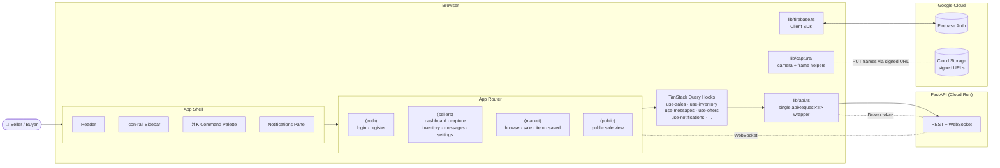
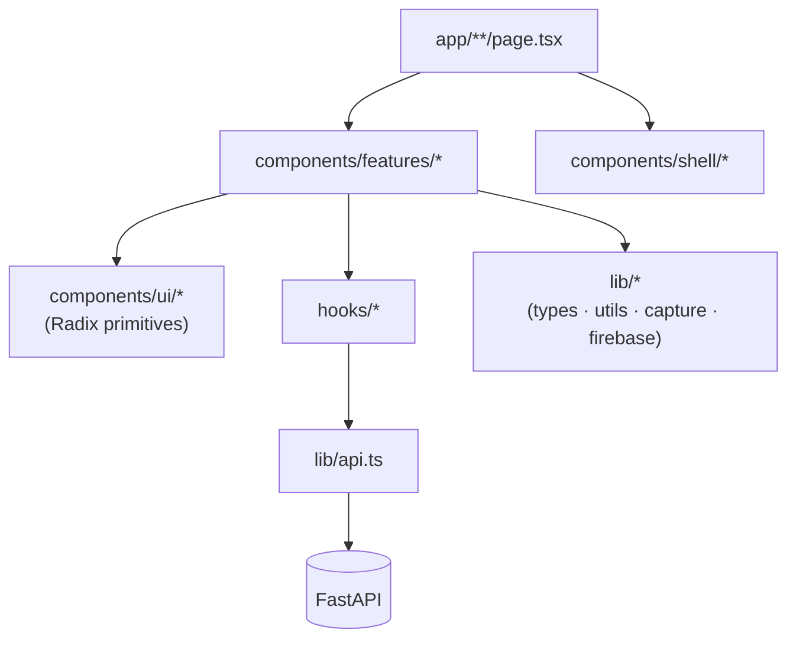
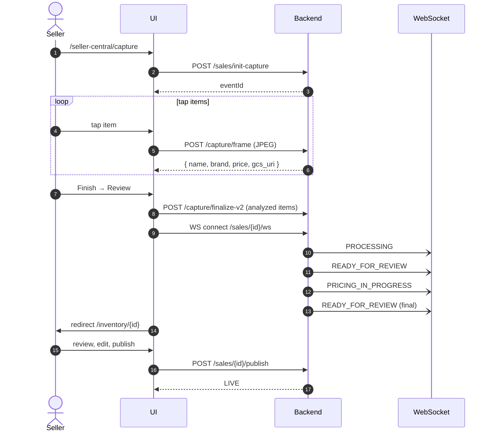
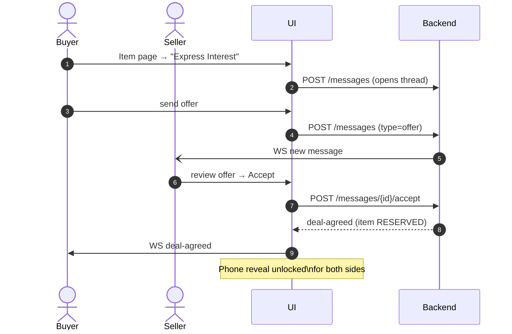
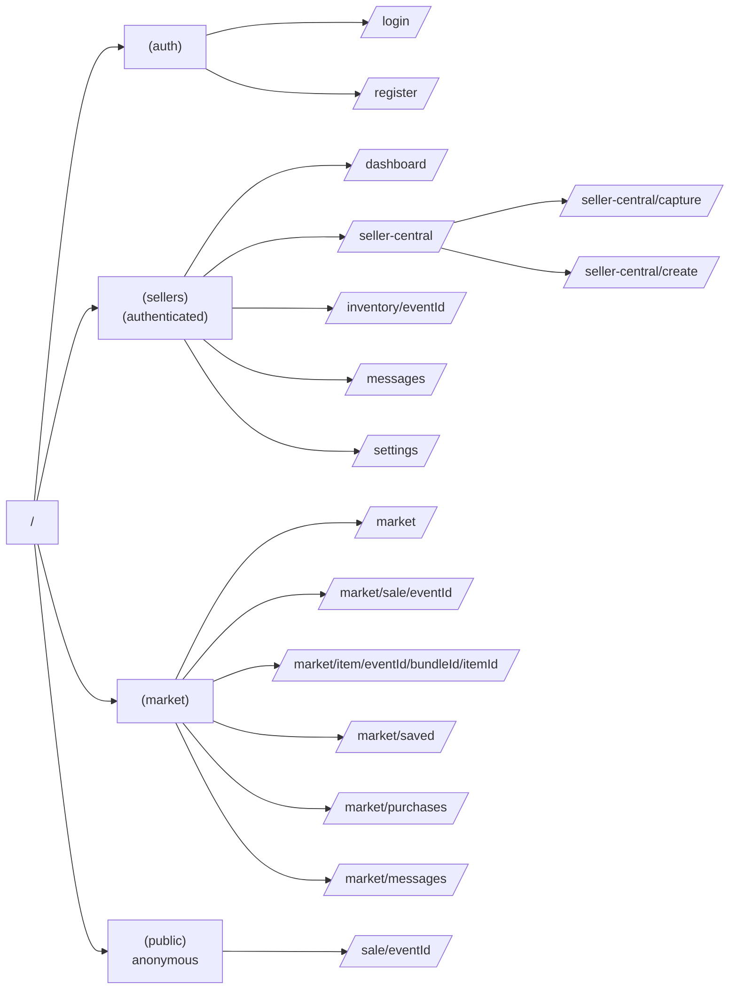
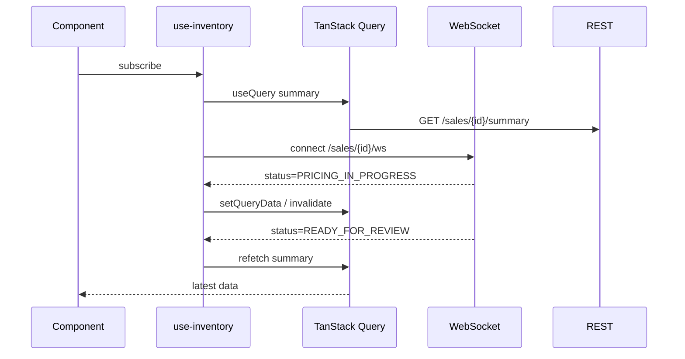
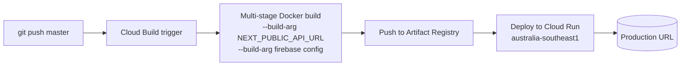

<div align="center">

# ShiftReady UI

**Seller dashboard and public marketplace for ShiftReady — an AI-driven residential relocation platform.**

[](https://nextjs.org/)
[](https://react.dev/)
[](https://www.typescriptlang.org/)
[](https://tailwindcss.com/)
[](https://tanstack.com/query/latest)
[](https://firebase.google.com/)
[](https://cloud.google.com/run)
[](#license)

Tap-to-capture inventory · AI extraction + pricing · buyer marketplace · offers + messaging.

[Companion Backend](../shiftready-backend) · [Live Production](https://shiftready-api-12644234558.australia-southeast1.run.app) · [Report Issue](https://github.com/ajayaradhya/shiftready-ui/issues)

</div>

---

## Table of Contents

- [Overview](#overview)
- [Key Features](#key-features)
- [Architecture](#architecture)
- [User Flows](#user-flows)
- [Tech Stack](#tech-stack)
- [Getting Started](#getting-started)
- [Project Structure](#project-structure)
- [Routing](#routing)
- [State & Data Fetching](#state--data-fetching)
- [Design System](#design-system)
- [Capture Pipeline (Client)](#capture-pipeline-client)
- [Authentication](#authentication)
- [Testing & Quality](#testing--quality)
- [Deployment](#deployment)
- [Contributing](#contributing)
- [License](#license)

---

## Overview

ShiftReady UI is a **Turborepo monorepo** containing the web app and native mobile app for the ShiftReady platform. Two audiences share both surfaces:

- **Sellers** — initiate a sale, capture inventory live or upload a walkthrough video, review and edit AI-extracted bundles, set a move-out deadline, publish to the marketplace, and message buyers.
- **Buyers** — browse the marketplace, save items, message sellers, make structured offers, and reveal seller contact info once a deal is agreed.

**Web (`apps/web/`):** Next.js 16 App Router app backed by [`shiftready-backend`](../shiftready-backend) over REST + WebSockets. Firebase handles authentication; TanStack Query handles data fetching.

**Mobile (`apps/mobile/`):** Expo 53 / React Native 0.79.6 app sharing the same backend API. Five-tab bottom nav for buyers and sellers.

---

## Key Features

- **Tap-to-capture** — single-tap item capture with on-device camera (web + native); Gemini identifies name/brand/price in the background.
- **Two-mode `ProcessingScreen`** — `live` (real captured items with thumbnails) or `batch` (animated discovery ticker for video uploads).
- **Inventory cockpit** — bundle/item CRUD, per-item photo gallery (upload, cover, lightbox, delete), append additional video.
- **Urgency pricing review** — Gemini-suggested prices with seller-editable overrides; reasoning displayed inline.
- **Marketplace** — buyer-side browse, sale detail, item detail, saved items, purchases, help.
- **Messages v2** — single thread per buyer-seller pair, structured offer/counter/accept, pinned item card, post-deal phone reveal.
- **Modern shell (web)** — slim header, icon-rail sidebar with hover-expand, profile popover, slide-over notifications, ⌘K command palette, mobile bottom tab bar.
- **Native mobile** — Expo app with 5-tab bottom nav (Market, Saved, Messages, Sell, Profile); unread badge on Messages tab.
- **Google SSO** — Google sign-in available on both web and mobile.
- **Expanded settings** — Profile (avatar, display name, bio), Account (Google SSO), Contact & Pickup (phone, suburb), Notifications (per-event toggles), Preferences (payment methods, pickup schedule, min offer threshold), Privacy (messaging filter, profile visibility, blocked users).
- **Real-time** — WebSocket-driven pipeline status and message delivery; polling fallback during AI processing.

---

## Architecture



### Component layering



---

## User Flows

### Live capture → marketplace publish



### Buyer offer → deal-agreed



---

## Tech Stack

| Layer | Technology |
|---|---|
| Monorepo | Turborepo 2 · pnpm 10 |
| Web framework | Next.js 16.2 (App Router, Standalone output) |
| Mobile framework | Expo 53 · React Native 0.79.6 · Expo Router 5 |
| UI (web) | React 19 · Tailwind v4 (`@theme` block) · Radix UI · lucide-react · sonner |
| UI (mobile) | NativeWind v4 · Ionicons · Expo Image · Reanimated 3 |
| State / Data | TanStack Query v5 · React Context |
| Forms (web) | react-hook-form + zod |
| Auth | Firebase 12 (Client SDK) · Google SSO (`GoogleAuthProvider`) |
| Capture (web) | Browser MediaDevices + canvas frame extraction |
| Capture (mobile) | Expo Camera + Image Manipulator |
| Command palette | cmdk |
| Class utilities | clsx + tailwind-merge (`cn()`) |
| Shared packages | `@shiftready/api` · `@shiftready/core` · `@shiftready/types` |
| Tooling | TypeScript 5 · ESLint 9 · Prettier 3 · prettier-plugin-tailwindcss |
| Deployment | Cloud Run · Cloud Build · Artifact Registry |

---

## Getting Started

### Prerequisites

- Node.js 20+ · pnpm 10+ (`npm install -g pnpm`)
- A running [`shiftready-backend`](../shiftready-backend) on `http://localhost:8080`

### Install

```bash
pnpm install        # install all workspace deps
# or
make install
```

### Configure

```bash
# Web
cp apps/web/.env.local.example apps/web/.env.local

# Mobile
cp apps/mobile/.env.example apps/mobile/.env.local
```

| Variable | App | Description |
|---|---|---|
| `NEXT_PUBLIC_API_URL` | web | Backend base URL. Local: `http://localhost:8080` |
| `NEXT_PUBLIC_FIREBASE_*` | web | Firebase Web SDK config |
| `EXPO_PUBLIC_API_URL` | mobile | Backend base URL. Local: `http://localhost:8080` |

### Run

```bash
# Web dev server
make web-dev        # http://localhost:3000
# or: pnpm dev

# Mobile (Expo Go)
make mobile-start
# or: pnpm --filter @shiftready/mobile start

# Native builds
make mobile-android
make mobile-ios
```

### Useful scripts

```bash
make web-build        # production build (standalone)
make web-lint         # ESLint
pnpm type-check       # tsc --noEmit
pnpm --filter @shiftready/web format       # Prettier write
pnpm --filter @shiftready/web format:check
make mobile-prebuild  # expo prebuild --clean (regenerate native projects)
make clean            # nuke node_modules + reinstall
```

### Full-stack session

```bash
# From the UI directory
claude --add-dir ../shiftready-backend

# Or from backend
claude --add-dir ../shiftready-ui
```

---

## Project Structure

```
shiftready-ui/
├── Makefile                          # Unified dev commands (web + mobile)
├── apps/
│   ├── web/                          # @shiftready/web — Next.js 16
│   │   └── src/
│   │       ├── app/
│   │       │   ├── layout.tsx        # Providers + Shell
│   │       │   ├── page.tsx          # Landing
│   │       │   ├── (auth)/           # login · register (no shell)
│   │       │   ├── (sellers)/        # Authenticated seller routes
│   │       │   │   ├── seller-central/ # Hub · capture · create
│   │       │   │   ├── inventory/[eventId]/
│   │       │   │   ├── messages/
│   │       │   │   ├── settings/     # Profile · Account · Contact · Notifs · Prefs · Privacy
│   │       │   │   └── dev/
│   │       │   ├── (market)/         # Buyer marketplace
│   │       │   └── (public)/         # Anonymous sale view
│   │       ├── components/
│   │       │   ├── shell/            # header, sidebar, command-palette, notifications-panel, profile-menu, bottom-tab-bar
│   │       │   ├── ui/               # Radix primitives
│   │       │   └── features/         # capture · create · inventory · seller-central · marketplace · messages
│   │       ├── hooks/                # TanStack Query + WS hooks
│   │       └── lib/
│   │           ├── api.ts            # All API calls — single apiRequest<T> wrapper
│   │           ├── types.ts          # Domain types
│   │           ├── firebase.ts       # Client SDK (Email/Password + Google SSO)
│   │           └── capture/          # Camera + frame helpers
│   └── mobile/                       # @shiftready/mobile — Expo 53
│       └── app/
│           ├── (auth)/               # login · register
│           ├── (tabs)/               # Market · Saved · Messages · Sell · Profile
│           ├── capture/              # Camera capture flow
│           ├── sale/[eventId]/
│           ├── item/[eventId]/[bundleId]/[itemId]/
│           ├── conversation/[convId]/
│           ├── seller/inventory/[eventId]/
│           ├── notifications/
│           └── purchases/
└── packages/                         # Shared workspace packages
    ├── api/                          # @shiftready/api — shared API client
    ├── core/                         # @shiftready/core — SYDNEY_SUBURBS, suburb lookup utils
    └── types/                        # @shiftready/types — shared domain types
```

### Web Hooks at a glance

| Hook | Purpose |
|---|---|
| `use-auth` | Firebase auth state + ID token plumbing |
| `use-sales` | List + status polling |
| `use-inventory` | Sale summary + WS + fallback polling |
| `use-upload` / `use-append-upload` | Video upload state machines |
| `use-websocket` | Reusable WS lifecycle + backoff |
| `use-messages` / `use-send-message` / `use-messages-ws` | Threads, send, real-time |
| `use-conversations` | Thread list |
| `use-offers` | Structured offer flow |
| `use-notifications` | In-app notifications |
| `use-saved` | Saved items |
| `use-pin` | Pinned item card in chat |
| `use-phone` | Post-deal phone reveal |
| `use-settings` | Full settings CRUD (`useMySettings`, `useUpdateProfile`, `useUpdateLocation`, `useUpdateNotifications`, `useUpdatePreferences`, `useUpdatePrivacy`) |
| `use-username` | `useUsername`, `useUsernameAvailability` |
| `use-landing` | Public landing data |

---

## Routing



App Router layout groups:

- `(auth)` — bare layout, no shell.
- `(sellers)` — authenticated shell (sidebar + header).
- `(market)` — buyer marketplace shell.
- `(public)` — anonymous sale view.

---

## State & Data Fetching

- Single `QueryClient` in `components/providers.tsx`.
- Default `staleTime: 5 min` for data stable during AI processing.
- Polling is **conditional** — only 1500 ms during `processing` / `pricing_in_progress`. Idle queries do not poll.
- All mutations call `queryClient.invalidateQueries` on success.
- WebSockets supplement (not replace) polling — pipeline events and message delivery push fresh state to the client.



---

## Design System

- **Dark-only.** `<html className="dark">` is hardcoded; light mode is not on the roadmap.
- **Tailwind v4** via `@theme {}` block in `src/app/globals.css`. No `tailwind.config.js`.
- **Layout invariants.** Authenticated shell pages use `pl-64` (sidebar) + `pt-16` (header). New pages must not override this.
- **Key tokens** (Tailwind classes):
  - Backgrounds: `bg-surface`, `bg-surface-container-low/high/lowest/highest`
  - Text: `text-on-surface`, `text-on-surface-variant`
  - Accents: `text-primary` (#adc6ff electric blue), `text-tertiary` (#4edea3 pricing/positive)
  - Borders: `border-outline`, `border-outline-variant`
- **Icons.** lucide-react only. Do not introduce additional icon libraries.
- **Class merging.** Use `cn()` from `lib/utils.ts` (clsx + tailwind-merge) for conditional class strings.
- **Component primitives.** Radix (Dialog, DropdownMenu, Tooltip, Slot) wrapped in `components/ui/`.

---

## Capture Pipeline (Client)

Tap-first capture lives in `app/(sellers)/seller-central/capture/page.tsx` and `components/features/capture/`.

1. `CapturePermissionsGate` — request camera (required); mic optional.
2. `CaptureStage` — `getUserMedia` live preview.
3. On tap → frame extracted via canvas → `POST /sales/{id}/capture/frame` → Gemini identify → result appended to `confirmedItems` (with `frameSrc` data URL for instant thumbnails).
4. "Finish" → `ItemReviewScreen` → edit/remove → "Upload & Process".
5. `finalizeCaptureV2(eventId, analyzedItems)` ships pre-analyzed items; backend refines + prices.
6. `ProcessingScreen` with `mode="live"` shows the real captured items + pricing status.
7. On `READY_FOR_REVIEW`, redirect to `/inventory/[eventId]`.

```tsx
<ProcessingScreen
  eventId={id}
  uploadedFile={null}
  mode="live"              // "batch" | "live"
  capturedItems={items}    // CapturedItem[] — live mode only
/>
```

`batch` mode (video upload) shows an animated discovery ticker because items are not yet known. Both modes share polling logic and CTAs.

---

## Authentication

- Firebase Client SDK (`lib/firebase.ts`).
- `AuthProvider` (in `providers.tsx`) maintains the current user + ID token.
- `lib/api.ts` holds a module-level `_idToken` set via `setAuthToken()`; auto-injected on every `apiRequest<T>()` call as `Authorization: Bearer ...`.
- WebSocket connections pass the token as `?token=` query param.
- Local dev: backend accepts `dev_*` tokens when `K_SERVICE` is absent — useful for Storybook-style page testing without Firebase.

---

## Testing & Quality

```bash
npm run lint          # ESLint (eslint-config-next)
npm run type-check    # tsc --noEmit
npm run format:check  # Prettier
npm run build         # production build (catches RSC issues)
```

End-to-end testing is run through the [`verify` skill](../shiftready-backend/CLAUDE.md) — boot backend + UI, exercise the live capture and publish flows, watch console + network for regressions.

---

## Deployment



- `output: 'standalone'` in `next.config.js` for minimal runtime image.
- `NEXT_PUBLIC_*` vars are **baked at build time** via Docker `--build-arg`. Changing the backend URL requires a new build — update the `_NEXT_PUBLIC_API_URL` substitution in the Cloud Build trigger.
- Traffic auto-migrates on deploy.

**Current production API:** https://shiftready-api-12644234558.australia-southeast1.run.app

### Manual deploy

```bash
gcloud builds submit --config=cloudbuild.yaml
```

---

## Contributing

1. Branch from `master`.
2. Match folder conventions:
   - New web page → `apps/web/src/app/<route>/page.tsx`
   - New API call → add to `apps/web/src/lib/api.ts` (single export per call) + type in `src/lib/types.ts`
   - New data hook → `apps/web/src/hooks/` using TanStack Query
   - New feature component → `apps/web/src/components/features/<feature>/`
   - New mobile screen → `apps/mobile/app/<route>/` using Expo Router
   - New shared type → `packages/types/`
3. Run `pnpm lint && pnpm type-check && make web-build` before pushing.
4. PR must include a screenshot or short clip if the change is user-visible.

Coding conventions:

- Functional components only; no class components.
- Server Components by default; mark `"use client"` only when needed (state, effects, refs).
- All data fetching via TanStack Query hooks — no `fetch` in components.
- All API calls go through `lib/api.ts`.
- Use `cn()` for conditional classes, never string concatenation.

---

## Additional Docs

- `CLAUDE.md` — guidance for AI pair-programming agents
- `AGENTS.md` — pointers for non-Claude coding agents
- `../shiftready-backend/README.md` — backend documentation

---

## License

Proprietary — ShiftReady © 2026. All rights reserved.
